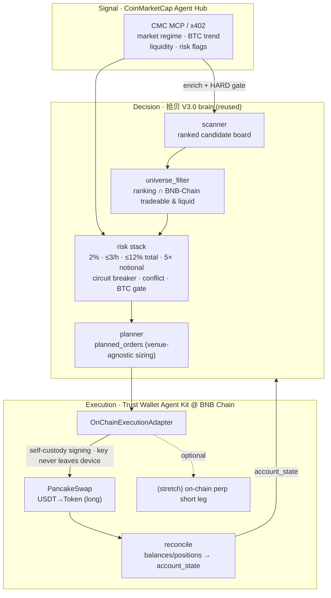

# Architecture

Three layers, mapped 1:1 to the three sponsor capabilities. The decision layer
is 拾贝 V3.0 reused almost verbatim; only the execution layer is new.

## Data flow (one cycle)

1. **Signal** — `CmcAgentHub.fetch_market_signal()` → `MarketSignal`
   (regime, BTC trend, fear/greed, risk flags, per-token liquidity).
2. **Account** — `Reconciler.read_account()` reads native BNB (gas), USDT, and
   token balances on BNB Chain → `AccountState` (+ rolling stop-loss events and
   per-hour order count carried forward for the circuit breaker / rate limit).
3. **Rank** — `Scanner.scan()` → ordered `List[Candidate]`. Ranking is 拾贝's own
   alpha (CMC does not replace the board); source precedence is
   `latest.json` → **CMC quotes** (CoinMarketCap Agent Hub — never a CEX API) → deterministic mock.
4. **Universe filter** — `UniverseFilter.filter()` keeps only candidates whose
   base asset is on-chain tradeable with enough DEX depth; the rest become
   `SkippedOrder(stage="universe_filter")`.
5. **Risk** — `apply_risk_stack()` applies, in order: BTC environment gate →
   stop-distance bound → within-batch conflict double-reject → opposite/same
   position checks → 24h circuit breaker → per-hour limit → ≤12% total initial
   risk → ≤5× total notional. Output `RiskDecision(approved, rejected, notes)`.
6. **Plan** — `build_planned_orders()` sizes each approved candidate
   (`risk_budget = equity × risk%`, `notional = risk_budget / stop_distance`,
   capped at `equity × max_leverage`, floored at `min_notional`) → `PlannedOrder`s.
7. **Exits** — `Reconciler.detect_exits()` emits `PlannedOrder(action=CLOSE)` for
   take-profit (≥2.5R), stop hits, and short max-hold.
8. **Execute** — `OnChainExecutionAdapter.execute_orders()` quotes on PancakeSwap,
   applies `minAmountOut`, runs the execution-time final guard, checks the gas
   floor, then (live only) approves the exact amount and swaps via the Trust
   Wallet Agent Kit. In dry-run it returns a fully-formed simulated receipt.
9. **Reconcile + notify** — account re-read, state persisted to
   `data/state/onchain_live.json`, Feishu card pushed.

## The decoupling seam

`PlannedOrder` is the contract that makes a 5-day port possible. The brain emits
it without knowing the venue; the adapter consumes it. Swapping Binance perps for
on-chain swaps is "implement a new `execute_*_prepared_orders`", exactly as the
technical plan describes — not a rewrite.

## Failure visibility

Nothing is dropped silently. Universe rejects, risk rejects, gas-floor failures,
slippage-guard trips, and swap errors all surface as `SkippedOrder` /
`ExecutionReceipt(status=...)` with a machine-readable reason, and (when enabled)
a Feishu alert. This is a direct port of 拾贝's "failures must be visible" rule.

## Live gate

`AgentConfig.live_orders_allowed` is the AND of: trading enabled, not dry-run,
confirm text matches, execution adapter armed, wallet address present, private key
present. Default config keeps it closed.
